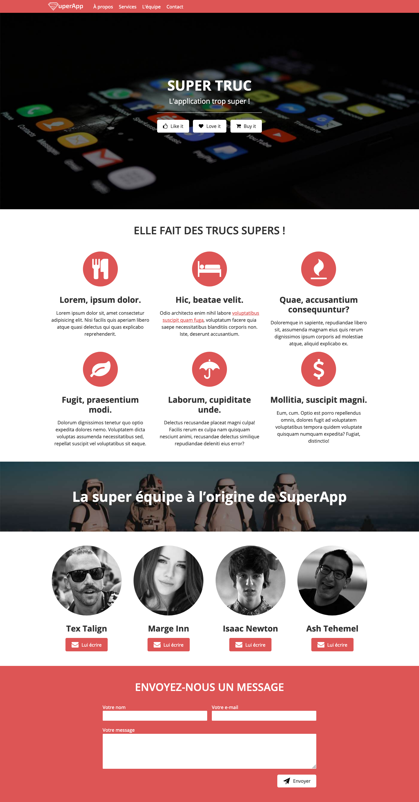
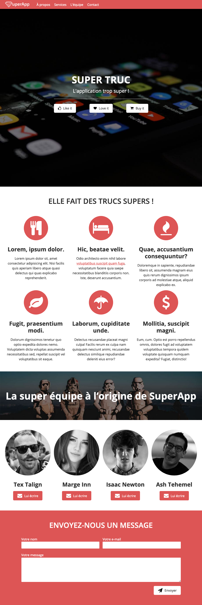
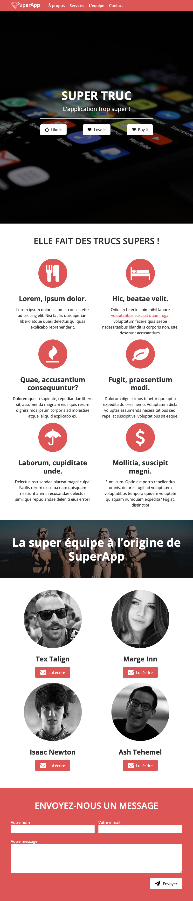
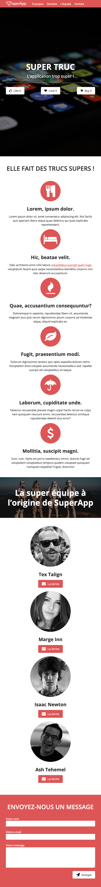
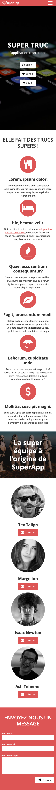

# SuperApp

Réalisation d'une page promotionnelle pour une application fictive, à partir d'une maquette.

## Maquette

Le site prend en charge plusieurs formats d'écrans et définitions en responsive design :

 
 

- Format ordinateur
 

    

 
 

- Format tablette paysage
 

    

 
 

- Format tablette portrait
 

    

 
 

- Format smartphone large
 

    

 
 

- Format smartphone
 

    

 

## Technos
   

 
    
     &nbsp &nbsp &nbsp &nbsp &nbsp
    

